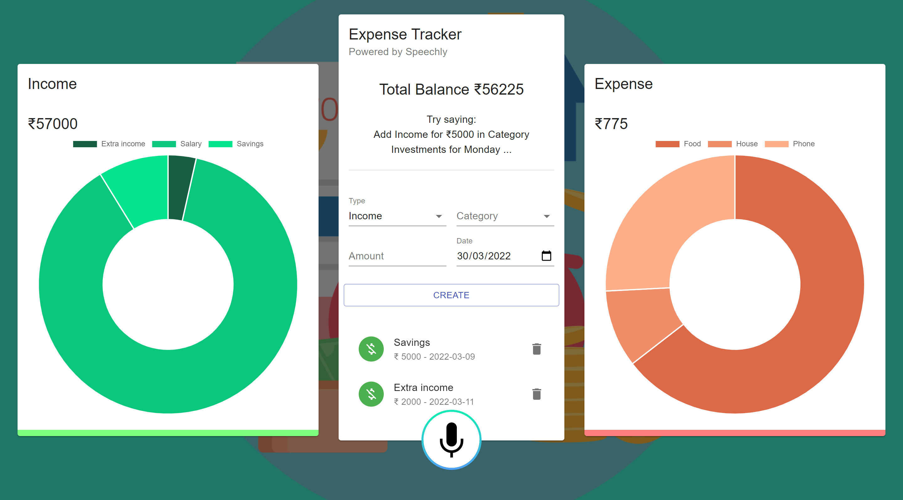
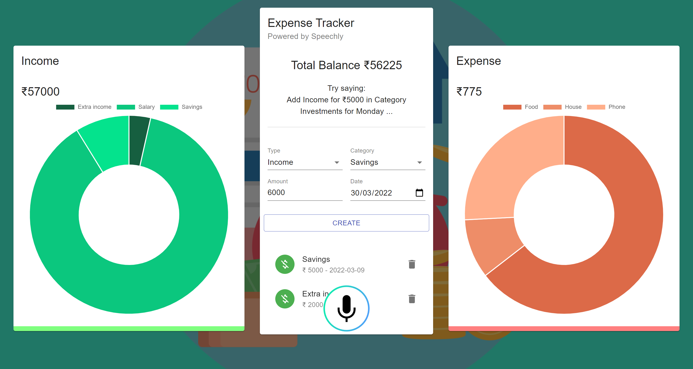

# Voice Powered Expense Tracker PWA

## Table of contents

- [Overview](#overview)
  - [Demo](#demo)
  - [Links](#links)
  - [Screenshot](#screenshot)
    - [Desktop](#desktop)
    - [Mobile](#mobile)
- [My process](#my-process)
  - [Built with](#built-with)
  - [What I learned](#what-i-learned)
- [Author](#author) 

## Overview
A complex expense tracker powered by speechly. The users can either enter the expenses manually or they can use their voice to record the transactions. The transactions are then plotted dynamically with the use of chart js. It uses local storage to store the data on the user's system and context API for state management.
### Demo

### Links

- Solution URL: [https://github.com/NandodkarAmogh/Voice-Powered-Expense-PWA](https://github.com/NandodkarAmogh/Voice-Powered-Expense-PWA)
- Live Site URL: [https://speechly-expense-tracker-pwa.netlify.app/](https://speechly-expense-tracker-pwa.netlify.app/)

### Screenshots

#### Desktop

#### Mobile

## My process

### Built with

- Mobile-first workflow
- [React](https://reactjs.org/) - JS library
- [Material UI](https://mui.com/)- Styling
- [ChartJS] (https://www.npmjs.com/package/react-chartjs-2) - for visual representation of expenses
- [Speechly] (https://www.speechly.com/) - for voice capabilities
### What I learned

Through this complex expense tracker application I learned how to use Speechly and turn a react app into a progressive web app (PWA). I also learned to use local storage with react applications and use of chartjs for plotting the expenses 
## Author

- Github - [@NandodkarAmogh](https://github.com/NandodkarAmogh)
- Portfolio - [https://amoghnandodkar.netlify.app/](https://amoghnandodkar.netlify.app/)

